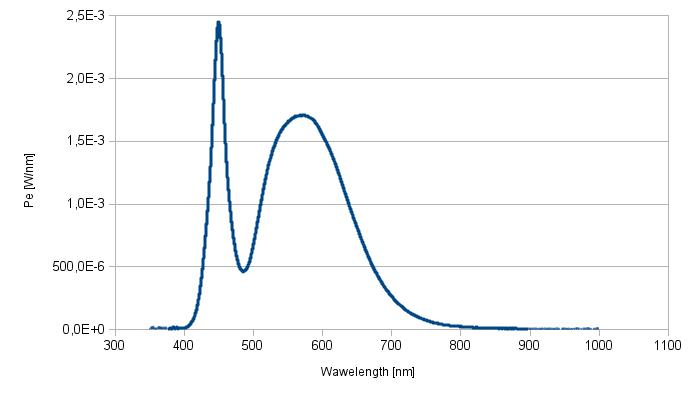

Laboratory measurement
======================

The light output of DarkStar headlamp was measured in light lab of Faculty
of Electrical Engineering of Brno University of Technology in
[Integrating sphere](https://en.wikipedia.org/wiki/Integrating_sphere).

The results can bee see in [Measure_results.csv](./Measure_results.csv),
first 7 measurements were run with only one LED at the maximum output power
(not the full 5W declared by manufacturer, but only about 3W to reduce heating).
Remaining columns are measured when running on full output setting on both LEDs.

The result of heating can be seen immediately, the light output drops from
the initial 104lm in cold state to 97lm (214lm to 195lm in full power configuration).
Expected light output on full power was around 300lm, however, this value is based
on datasheed, the real output is lower due to lower efficiency of LED working
on higher temperatures, losses in the optics and plexi cover, etc.

The Correlated Colour Temperature (CCT) is between 4550 and 4900 Kelvins (depending
on current power output). The dominant wavelenght is around 575nm.

The relative spectral power distribution quite matches the datasheet graph:

