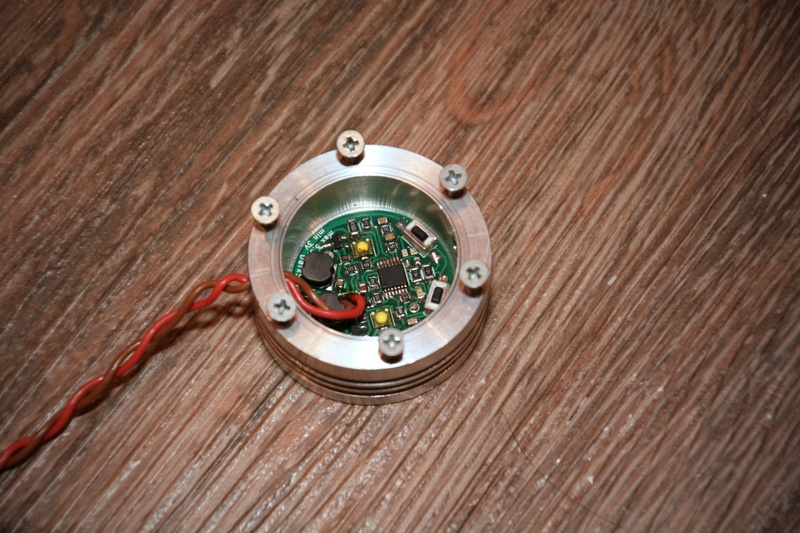
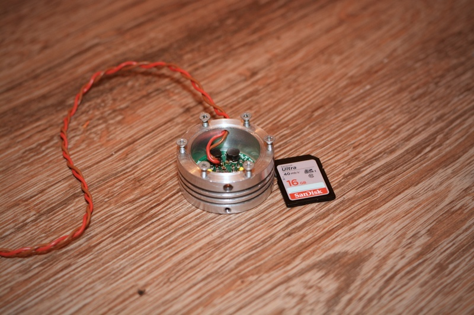

DarkStar headlamp
=================

Small, lightweight and waterproof LED headlamp with two Cree XP-G2 leds. Can be
used in biking, caving, mine exploration, hiking... But **always** carry a
**backup** light source.

Features
--------
* Two 5W Cree XP-G LEDs with independently controlled brightness
* Up to 916lm (is using cool white LED), software cropped to about 600lm to reduce heat generation
* Always on LED with spread beam to illuminate surroundings
* One wide beam (115 degrees) LED to illuminate long tunnels, big caves, etc.
* Small red status LED, can be replaced with UV or used as emergency light when the battery is almost dead (required swapping one resistor)
* Controlled by PIC 16F616 MCU (source code included)
* Low power off current (TODO uA), no need to unplug battery during power off state
* Waterproof aluminium body
* 3D printed battery box (hopefully waterproof) for two 18650 cells
* Whole headlamp including batteries weights only TODO grams

Controls
--------
* Connect headlamp to battery, LEDs will flash and device goes to sleep
* Press and hold up button for about 2 seconds, first LED turns on
* Use up/down buttons to increase/decrease LEDs intensity
* Press and hold down button for about 2 seconds to turn on/off second LED
* When the second LED is on, use up/down buttons to control its intensity
* Press and hold up button for about 2 seconds to turn the lamp off

Warning
-------
LiIon cells can catch fire or explode if not handled properly. The hardware
design has not been extensively tested, the headlamp could die any time, don't
rely on it as a single source of light.

The headlamp body can get quite hot if both LEDs are running on full power,
there's no thermal protection, you have been warned.

License
-------
This headlamp is provided under opensource license WITHOUT ANY WARRANTY, see
[LICENSE](./LICENSE) for more details.

HowTo
=====
Directories
-----------
* **cad** headlamp body and battery box designs in FreeCad
* **pcb** contains all kicad files including BillOfMaterials for electronics,
	please note plated vias under Cree LEDs are required to move heat from
	LED to heatsink (body). Gerber files for manufacturing are included.
* **pic** contains assembly source code for the headlamp MCU

Electronics & software
----------------------
For overview how the hardware works, check
[microchip application note](http://ww1.microchip.com/downloads/en/AppNotes/00874C.pdf)
and [source code README](./pic/README.md).

To reduce manufacturing costs, the heat from CREE LEDs is transferred to aluminium
body using several plated vias under the LED itself thus avoiding the need for
aluminium PCB or big star heat sink for each LED. For some math background, check
the [Cree thermal management guide](http://www.cree.com/~/media/Files/Cree/LED%20Components%20and%20Modules/XLamp/XLamp%20Application%20Notes/XLamp_PCB_Thermal.pdf).

Power wires are soldered directly to the PCB. To program the MCU, solder
wires to ICMP pins or build some kind of pin-touch interface. Use *make* in
pic directory to compile the sources (assuming you are running Linux), also
you can use *make burn* to upload the firmware using pickit2.

Lenses
------
The wide beam LED can be used without lenses, the beam width is enough for my
needs, for the narrow beam LED you can buy any compatible lens (it will require
some modifications due to limited space on PCB though) or build your own
using few trash pieces of metal and a lathe.

Body
----
The body has been made of a piece of aluminium *6082 T6* on a small lathe. Top
cover is made from plexiglass taken from old diving goggles. Waterproofness is
ensured by big O-ring between body and glass and two small O-rings on the
control knob. The body works also as a heat sink for LEDs, therefore it can't
be made from plastic (e.g. on 3D printer).

The battery box is printed on 3D printer from ABS (I would rather use aluminium,
but I don't have access to milling machine).

